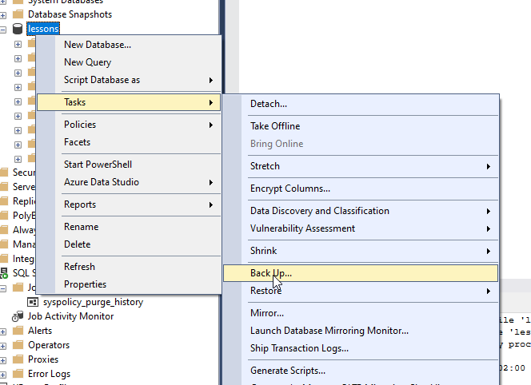

# Backup

The easiest way to backup you database is:

```sql
BACKUP DATABASE [lessons]
TO  DISK = N'C:\ws\lesssons.bak'
-- WITH DIFFERENTIAL, CHECKSUM
WITH CHECKSUM;
```

You can always backup with sql management studio as well :)



Let's create schedule job for database ackup.