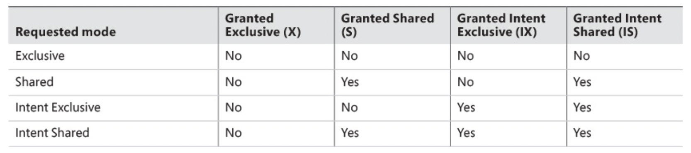

# Lockable resource types

* Server can lock different types of resources. Those include rows (RID in a heap, key in an index) pages, objects (for example, tables), databases, and others.
* In most cases lock are managed by Server and locks can be differ depend on number or records.

* When one transaction holds a lock on a data resource and another transaction requests an incompatible lock on the same resource, the request is blocked and the requester enters a wait state.

Let's look at example