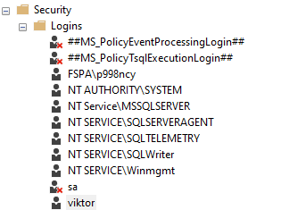
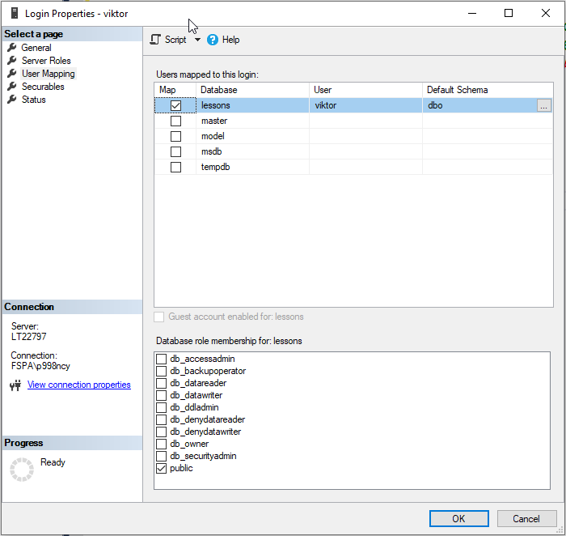

# Managing Security Objects

SQL Server logins, users, and roles have their own corresponding CREATE and DROP statements. The syntax for creating a new login is slightly different depending on whether the new login is a Windows login or a SQL Server login.

We will look into only login related to SQL Server login

```sql
USE Master
GO
CREATE LOGIN viktor WITH PASSWORD = 'P@ssword1' USE lessons
GO
CREATE USER viktor FOR LOGIN viktor
```



---



Grant select on schema
```sql
USE [lessons]
-- GRANT
GRANT SELECT ON SCHEMA :: HR TO viktor WITH GRANT OPTION;
-- DENY
DENY SELECT ON SCHEMA :: HR TO viktor  CASCADE;
```

Authorize user to read all data e.g.
```sql
USE [lessons]
-- Add
ALTER ROLE db_datareader ADD MEMBER viktor;
-- Drop
ALTER ROLE db_datareader DROP MEMBER viktor;
```

Drop user

```sql
USE lessons
GO
DROP USER viktor
GO USE Master
GO
DROP LOGIN viktor
```

What options we can use during user creation we can inspect through SQL Server management.